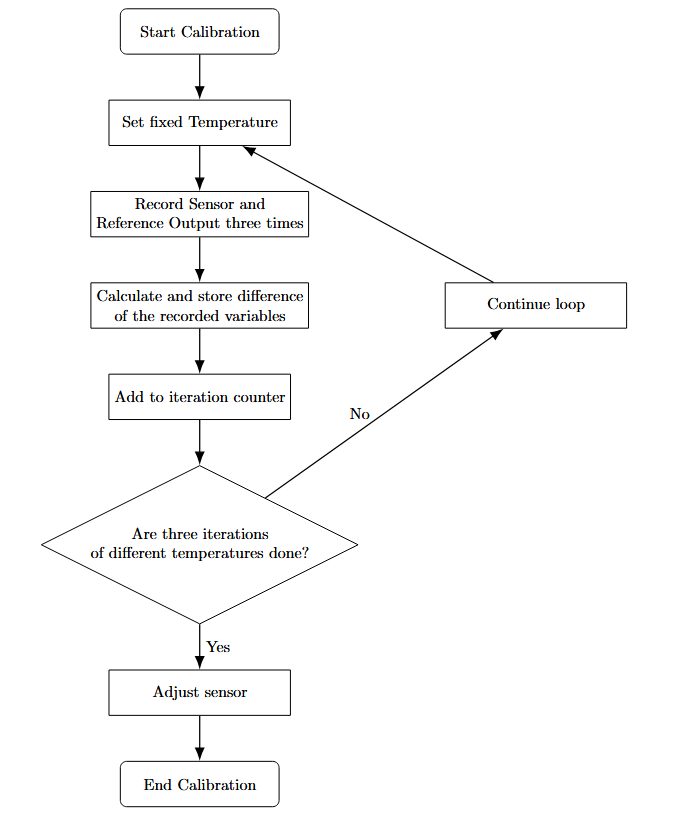
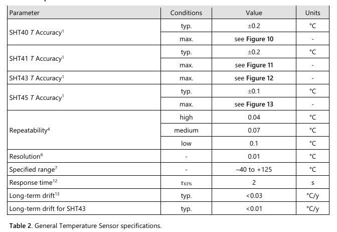
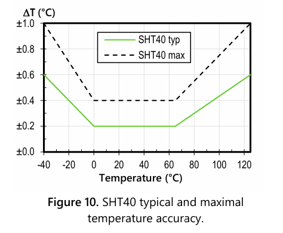
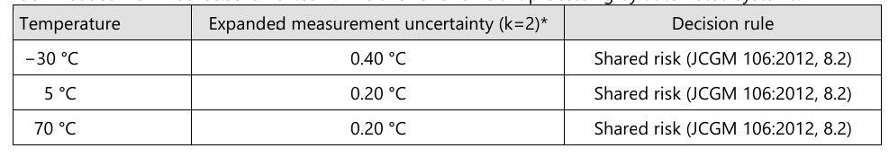
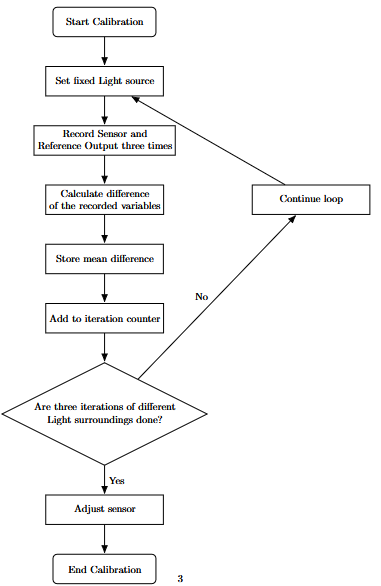
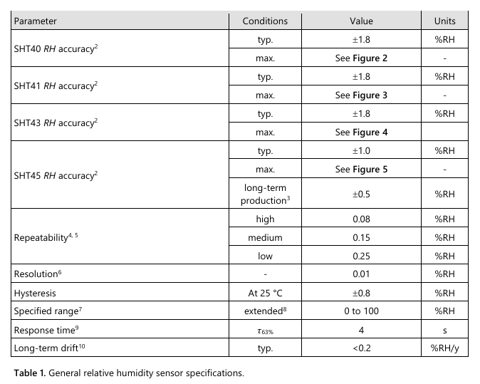
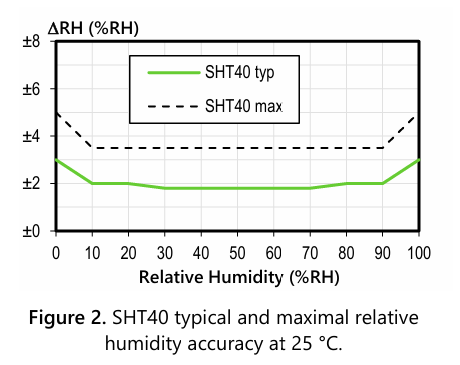
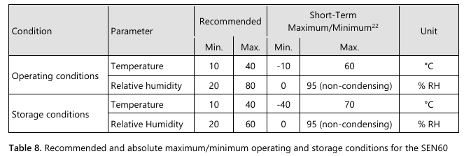
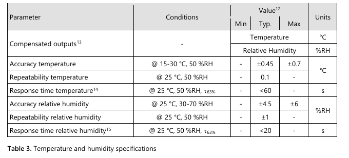
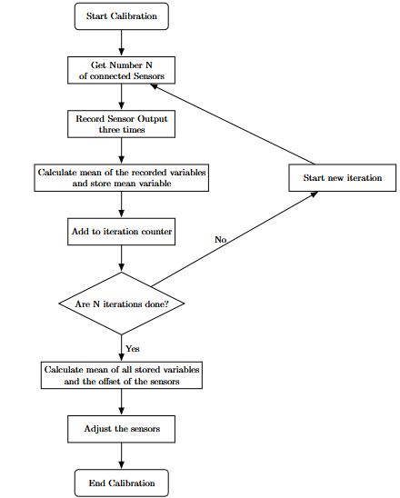

# Calibration workflow
    Temperature and Humidity Sensor: SHT40-AD1B-R2
    Light Sensor: VEML7700-TR 
    Air Quality Sensor: SEN66-SIN-T
## Calibration of temperature sensor
For calculating the temperature sensor individually a reference thermometer should be used. Also a reasonable range around room temperature for temperatures should be established. Both thermal sensors are connected in the calibration script.
Then a loop is necessary to record different inputs at various times and temperatures, that have to be manually controlled. 

In the loop the sensor and reference measure the temperature in a short time interval. Then the differences in measured variables and the mean difference are calculated. 

?Accuracy: +- 0.1°C?  
Seen here is that the Accuracy of the Temperature Sensor is constant at +-0.2°C for room temperatures. For the measuring set-up the probable temperature will lie within reasonable range from room temperature at approx. 21°C.

Furthermore at Temperatures up to 70°C the uncertainty was not bigger than 0.2°C, which will not be reached in testing, because that would make the measured environment unhabitable for humans.

## Calibration of light sensor
As with the thermal sensor the calibration of the light sensor works with different light modes of an extern light source. The workflow of calibration is the same as the calibration of the thermal sensor.

## Calibration of humidity sensor
 integrated into temperature sensor, can they be calibrated together?

 Accuracy: +- 1.0 %RH

## Calibration of air quality sensor

wie funktioniert die Berechnung der air Quality?

The SEN6x sensor module family is an air quality platform that combines critical parameters such as particulate 
matter, relative humidity, temperature, VOC, NOx and either CO2 or formaldehyde. The used sensor in the modul build up has most of the named parameters, only the formaldehyde sensor is not included. 

• Particulate Matter 
• Relative Humidity 
• Temperature 
• VOC Index 
• NOx Index 
• CO2 
es wäre gut zu wissen, welche sensoren in unserem Sensor eingebaut sind siehe Poduct Overview Tabelle im Datasheet

Digital output

## Quickcalibration
Quickcalibration mode is a simplified version of all versions of calibration for individual sensors. The mean of the connected sensors is used as the calibrations ground truth. 
For example for the thermal sensor this means recording three times in a short time window, then calculating the mean of the recorded variables.
This should be repeated for all n connected sensors, so there is a loop hat iterates through all connected sensors. Every sensor is used to measure three times and the mean of this three measured variables is calculated and stored.
Calculate mean variable:
$$ v_{mean}(n) = \frac{1}{3} \sum_{i=1}^{3}v_i(n)$$ 
where n = 1,2,..., and $v_i(n)$ with i = 1,2,3 are the three measured variables in one iteration.

After the programm iterated through every sensor the mean of v(n) is calculated. This can now be used to determine the offset of the individual sensors and adjust them.

Calculate mean of all stored variables:
$$ mean_{all}(n) =  \frac{1} {N}\sum_{n=1}^{N} v_{mean}(n)$$

$$ offset(n) = v_{mean}(n) - mean_{all}(N)$$

The process of quick calibration is valid for all different types of sensors. 
